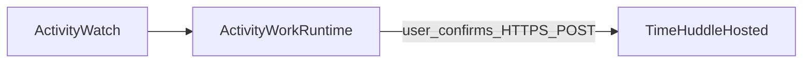

# Handoff: Time Huddle — accept manual imports from local ActivityWork-runtime

Use this document when a Cursor agent (or human) is working **only** in **TimeHuddlePlaceholder**. Goal: after a user **confirms** data in **local** ActivityWork-runtime, they **send** (HTTPS POST or file upload) a snapshot JSON payload to this **hosted** app. The Meteor server **stores or displays** that payload; it does **not** pull ActivityWatch on the user’s laptop.

## Facts (current integration)

- **Server-only SDK:** `[imports/api/activityWork/createClient.js](../imports/api/activityWork/createClient.js)`, `[imports/api/activityWork/methods.js](../imports/api/activityWork/methods.js)` — `activityWork.checkHealth`, `activityWork.preview`, `activityWork.snapshotUrl` (all assume `ACTIVITYWORK_URL` is reachable **from the Meteor server**).
- **UI:** `[imports/ui/App.jsx](../imports/ui/App.jsx)` toggles ActivityWork and calls those methods.
- **Env:** `ACTIVITYWORK_URL`, `ACTIVITYWORK_TOKEN`, `ACTIVITYWORK_SNAPSHOT_RANGE`, `ACTIVITYWORK_BUCKET_ID` — see `[agent-handover-activitywork-timehuddle.md](agent-handover-activitywork-timehuddle.md)`.

## Contract (shared across repos)

- **Schema owner:** **Successful** `GET /api/aw/snapshot` JSON from ActivityWork-runtime (same shape the SDK’s `ActivityWorkClient.snapshot()` expects on success).
- **Versioning:** When runtime adds `**schemaVersion: 1`**, require it in import validation and bump `@sarkarshubh/activitywork-sdk` together with runtime.
- **Transport:** Accept only data **pushed** by the user (POST from local export route, paste, or file upload). **No** server-side fetch to user `localhost`.

## Target flow

## Implementation checklist (ordered)

1. **Import API:** Add either:
  - **Meteor method** e.g. `activityWork.importSnapshot` with `{ payload }` or `{ jsonString }`, **or**
  - **HTTP POST** route (e.g. WebApp/connect handler) for the runtime’s server-side `fetch` to hit.
   **Pick one** and document it in the runtime handoff so `TIMEHUDDLE_IMPORT_URL` points to the right URL.
   **TimeHuddlePlaceholder:** canonical route is **`POST /api/activitywork/import`** (see `imports/api/activityWork/importHttp.js` and `docs/agent-handover-activitywork-timehuddle.md`).
2. **Validation:** Lightweight inline check in `imports/api/activityWork/validateSnapshotImport.js` — accepts any plain JSON object, rejects explicit `ok: false` envelopes, requires `events` to be an array when present. No SDK dependency on the import/receive path; we just store whatever `activitywork-gateway` sends.
3. **Limits:** `ACTIVITYWORK_IMPORT_MAX_BYTES` (or similar) on the server; reject oversize bodies before parse.
4. **Rate limiting:** Add a placeholder (e.g. per-connection throttle or TODO with suggested cap) so imports cannot spam the server in the placeholder app.
5. **Auth / placeholder security:** Methods are still unauthenticated — document that production must gate imports behind auth. Optional shared secret header for server-to-server from runtime POST (`ACTIVITYWORK_IMPORT_SHARED_SECRET`).
6. **Persistence:** Stub acceptable (in-memory last import per server restart, or a small Mongo collection). Document schema intent for “real” Time Huddle.
7. **UI:** Section **“Import from local ActivityWork”** — paste JSON, file pick, or instructions linking to runtime “Send”. Keep the existing “live ActivityWork” toggle **labeled clearly** (e.g. “ActivityWork reachable from **this server**”) so it is not confused with local-only data.
   - **Pushed Snapshot tab** (`imports/ui/views/SnapshotView.jsx`): dedicated view for the full payload received via POST `/api/activitywork/import`. Reads from the Meteor method `activityWork.getLastImportPayload` (server-side parse of `getLastImportRawBody()`), polls every 6s while visible, and renders a metadata header (received-at, range, bucket, event count, total active time, source host / user-agent) plus an events table (Start / Duration / Watcher / App / Title / URL). The Overview tab keeps the compact "Latest snapshot push" card and the legacy paste / file import and live ActivityWork toggle.

## Acceptance criteria

- Hosted app accepts a snapshot-shaped JSON **without** contacting the user’s `localhost`.
- Invalid / oversized / non-`ok` payloads fail with stable `Meteor.Error` codes (mirror existing `mapSdkError` style).
- Cross-repo agents align on the same payload: runtime handoff + SDK validator version.

## Suggested cross-repo implementation order

1. **activitywork-runtime:** lock snapshot import schema (optional `schemaVersion`).
2. **activitywork-sdk:** `validateSnapshotPayload` + publish — see `[../../docs/handoff-activitywork-sdk-manual-import.md](../../docs/handoff-activitywork-sdk-manual-import.md)`.
3. **TimeHuddlePlaceholder:** this checklist (import API + UI + persistence stub).
4. **activitywork-runtime:** export POST / download UX.

## Related handoffs

**Note:** Paths below assume sibling repos under one parent directory. Adjust if you only cloned `TimeHuddlePlaceholder`.

- Runtime export / POST proxy: `[../../activitywork-runtime/docs/handoff-manual-export-to-timehuddle.md](../../activitywork-runtime/docs/handoff-manual-export-to-timehuddle.md)`
- SDK validation + release (monorepo index): `[../../docs/handoff-activitywork-sdk-manual-import.md](../../docs/handoff-activitywork-sdk-manual-import.md)`
- SDK package handoff: `[../../activitywork-sdk/docs/handoff-manual-import-support.md](../../activitywork-sdk/docs/handoff-manual-import-support.md)`
- Original networking + SDK integration context: `[agent-handover-activitywork-timehuddle.md](agent-handover-activitywork-timehuddle.md)`

